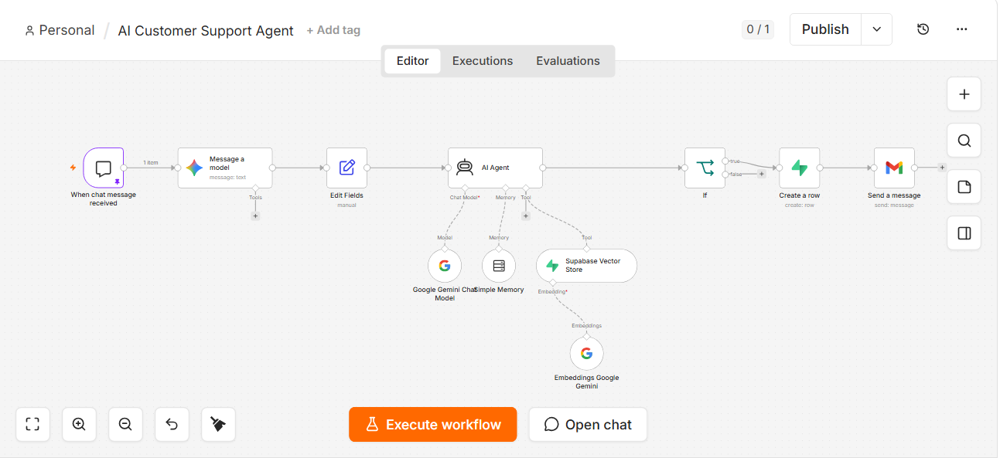
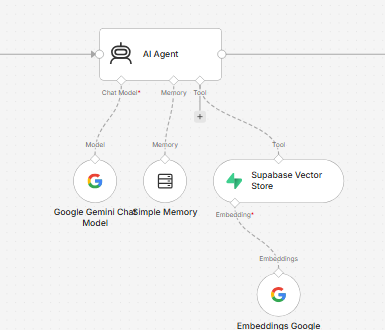
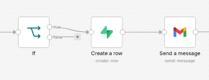

# AI Customer Support Agent with n8n

An **AI customer support agent built with n8n** that combines **Google Gemini, Retrieval-Augmented Generation (RAG), Supabase Vector Store, conversation memory, and human escalation**. It is designed to answer customer questions from a business knowledge base, maintain conversational context, analyze sentiment, and route conversations that need human attention to support staff.

This project demonstrates a practical **n8n AI automation workflow** for customer support, knowledge-base search, semantic retrieval, and human-in-the-loop escalation. The same architecture can be adapted for e-commerce support, product questions, order status, refunds, shipping, service businesses, and internal knowledge assistants.

## Key capabilities

- AI-powered customer support responses
- Retrieval-Augmented Generation (RAG) for business-specific knowledge
- Semantic search with Supabase Vector Store and Gemini embeddings
- Conversation memory for multi-turn support interactions
- Customer sentiment analysis
- Human-in-the-loop escalation
- Supabase escalation logging
- Gmail support notifications
- Sanitized n8n workflow export for learning and reuse

## What this automation does

1. Receives a customer message through the n8n chat trigger.
2. Uses Google Gemini to analyze the incoming message.
3. Extracts useful information such as customer sentiment and order-related details.
4. Passes the message to an AI Agent.
5. Gives the AI Agent access to a Supabase Vector Store for knowledge retrieval.
6. Uses Gemini embeddings for semantic search.
7. Keeps conversation context with n8n Simple Memory.
8. Generates a contextual support response.
9. Checks the conversation for escalation conditions.
10. Logs an escalation in Supabase when required.
11. Sends a notification to human support through Gmail.

## Workflow Overview



The workflow connects the customer chat, AI analysis, AI Agent, knowledge retrieval, conversation memory, and human escalation path in one n8n workflow.

## Workflow architecture

```text
Customer Message
      |
      v
n8n Chat Trigger
      |
      v
Google Gemini Analysis
      |
      v
Edit / Prepare Fields
      |
      v
AI Agent
  |       |       |
  |       |       +--> Simple Memory
  |       |
  |       +----------> Supabase Vector Store
  |                         |
  |                         +--> Gemini Embeddings
  |
  v
Support Response
      |
      v
Escalation Check
      |
      +---- No ----> End
      |
      +---- Yes ---> Supabase Escalation Log
                         |
                         v
                    Gmail Notification
```

## Main components

| Component | Purpose |
|---|---|
| n8n Chat Trigger | Receives the customer message |
| Google Gemini | Analyzes messages and powers the AI response |
| AI Agent | Handles the support conversation and uses available tools |
| Supabase Vector Store | Provides business-specific knowledge retrieval |
| Gemini Embeddings | Converts knowledge into embeddings for semantic retrieval |
| Simple Memory | Maintains conversational context |
| Supabase | Stores escalation information |
| Gmail | Notifies human support when escalation is required |

## AI Agent & RAG



The AI Agent uses Google Gemini as its chat model, Simple Memory for conversational context, and the Supabase Vector Store to retrieve relevant business knowledge.

## RAG knowledge retrieval

The AI Agent is connected to a Supabase Vector Store. This allows the agent to retrieve relevant information from a business knowledge base instead of relying only on the model's general knowledge.

Example knowledge can include:

- Product information
- Company policies
- FAQs
- Refund and return policies
- Shipping information
- Warranty information
- Pricing
- SOPs
- Support documentation
- Service descriptions
- Technical documentation

## Human escalation



The workflow includes a human-in-the-loop path for conversations that require additional attention.

When an escalation condition is met, the workflow:

1. Stores the escalation information in Supabase.
2. Sends a Gmail notification to human support.

## Repository structure

```text
ai-customer-support-agent-n8n/
├── README.md
├── screenshots/
│   ├── workflow-overview.png
│   ├── ai-agent-rag.png
│   └── escalation.png
├── workflow/
│   └── ai-customer-support-agent.json
├── docs/
│   └── architecture.md
└── .env.example
```

## How the workflow works

The customer message enters n8n through the chat trigger. Google Gemini analyzes the message and extracts relevant information before the AI Agent generates a response. The agent can query the Supabase Vector Store to retrieve relevant business knowledge and uses conversation memory to maintain context. After the response, the workflow checks whether the conversation should be escalated. If escalation is required, the event is stored in Supabase and human support receives a Gmail notification.

## Importing the workflow

The JSON file in `workflow/` is a sanitized export of the n8n workflow.

Before using it in your own n8n instance, configure your own credentials and replace the example configuration with your own:

- Google Gemini credentials
- Supabase credentials
- Gmail credentials
- Supabase project/table configuration
- Knowledge base/vector store configuration

Do not commit API keys, passwords, tokens, private webhook URLs, or production credentials.

## Tech stack

- n8n
- Google Gemini
- Supabase
- Supabase Vector Store
- RAG
- AI Agents
- Conversation Memory
- Gmail
- Conditional workflow automation

## Business use cases

This pattern can be adapted for:

- E-commerce customer support
- Order status questions
- Refund and return support
- Shipping questions
- Product support
- Service businesses
- Internal employee support
- Knowledge-base assistants

## About

Built by **Israel Ojo**, AI & Workflow Automation Specialist.

I build AI-powered workflows, CRM automations, API integrations, and business process automations using tools such as n8n, Make.com, LLMs, and business platforms.

- Portfolio: https://ojo-israel-portfolio.lovable.app
- LinkedIn: https://www.linkedin.com/in/ojo-israel-ai-and-workflow-automation

## Keywords

n8n AI automation, AI customer support agent, n8n customer support workflow, Google Gemini AI agent, RAG customer support, Retrieval-Augmented Generation, Supabase Vector Store, semantic search, AI support automation, human-in-the-loop automation, customer service automation, knowledge base chatbot, LLM workflow automation

## Security

This repository contains a sanitized workflow intended for public learning and portfolio demonstration. Never commit real API keys, access tokens, passwords, webhook secrets, database credentials, or customer information. See [SECURITY.md](SECURITY.md) for reporting guidance and security practices.
